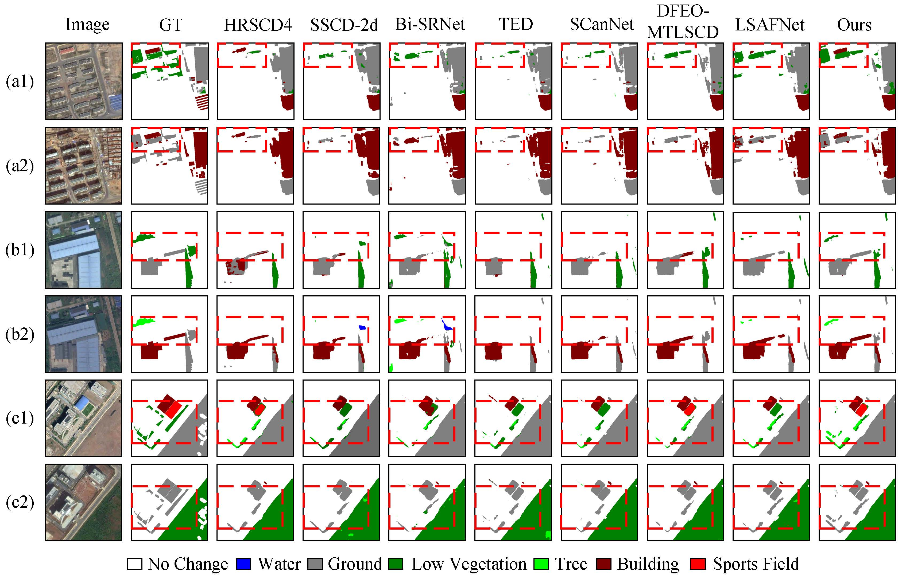

# BCLSCD
This is our Pytorch implementation for BCLSCD.

# Prerequisites

* Linux or macOS

* Python 3

* CPU or NVIDIA GPU + CUDA CuDNN

# Testing

The SECOND datasets used to test are organized [HERE](https://pan.baidu.com/s/1h-HhJ4pQ0eBQY-eu-9mJPw) (提取码：rqxg). Please uncompress it into the root path. 

The test model in our paper for the SECOND dataset are found [HERE](https://pan.baidu.com/s/1_mQeLW-bik5E5BlnkYnsyw) (提取码：bj24). Please make a new directory `./model/SECOND/ours` under the root path and uncompress it under `./model/SECOND/ours`. 

## Testing on SECOND Dataset:

```javascript
python test.py 
```


